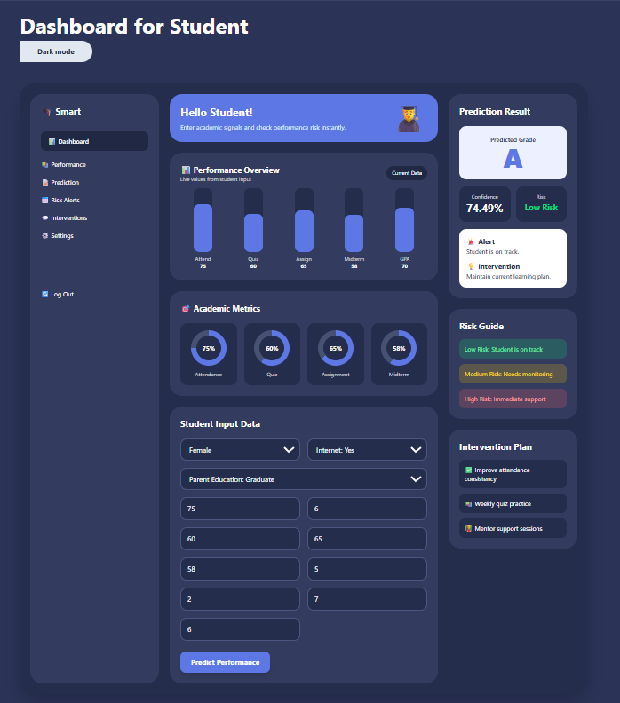
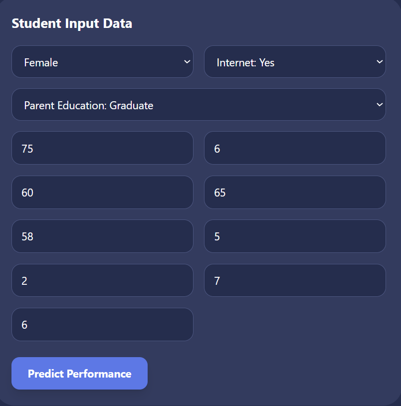
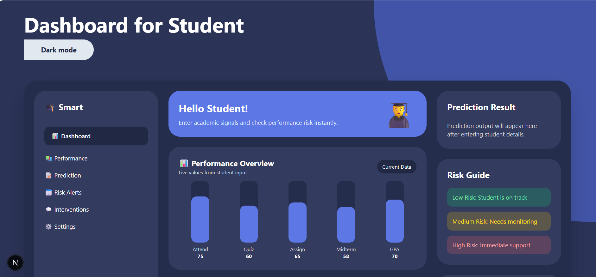
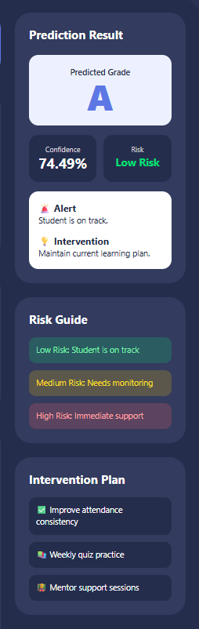
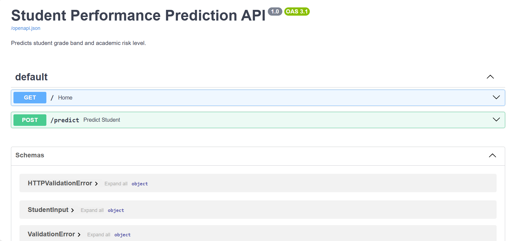

# 🎓 Student Performance Prediction System

An **end-to-end Machine Learning + Full Stack project** that predicts a student's academic performance using semester-long data such as attendance, study hours, quiz scores, assignments, and engagement.

This system provides:

* 📊 Performance prediction (Grade A–F)
* ⚠️ Risk level detection (Low / Medium / High)
* 💡 Personalized intervention suggestions
* 🌐 FastAPI backend for real-time prediction
* 🎨 Premium Next.js dashboard for visualization

---

# 📌 Objective

To build an intelligent system that helps educational institutions:

* Identify weak students early
* Improve academic performance
* Enable personalized learning
* Prevent dropouts using data-driven insights

---

# 🧠 How the System Works

```text
Student Input Data
        ↓
Data Preprocessing
        ↓
Feature Engineering
        ↓
Machine Learning Model (XGBoost)
        ↓
FastAPI Backend (Prediction API)
        ↓
Next.js Dashboard (UI)
        ↓
Grade + Risk + Intervention Output
```

---

# 🧪 Dataset & Simulation

Since real academic data is sensitive, this project uses **synthetic data generation**.

### 🔹 How Simulation Works:

* Random but realistic student data is generated
* Academic patterns are simulated:

  * High attendance → better scores
  * Low study hours → lower performance
* Target variable (`grade_band`) is assigned based on performance rules

### Features Used:

* Gender
* Attendance (%)
* Study hours per week
* Quiz average
* Assignment score
* Midterm score
* LMS logins
* Forum posts
* Previous GPA
* Sleep hours
* Internet access
* Parent education

---

# 🤖 Machine Learning Model

### Model Used:

```text
XGBoost Classifier
```

### Why XGBoost?

* Works well on structured/tabular data
* Handles non-linear relationships
* High accuracy and performance
* Industry-level model

---

# 📊 Model Output

Example API Response:

```json
{
  "predicted_grade": "A",
  "confidence": 74.49,
  "risk_level": "Low Risk",
  "alert": "Student is on track.",
  "intervention": "Maintain current learning plan."
}
```

---

# 📂 Folder Structure

```text
Student-Performance-Prediction-System/
│
├── app/                     # FastAPI backend
│   └── main.py
│
├── data/
│   ├── raw/                 # Generated dataset
│   └── processed/
│
├── dashboard/              # Next.js frontend
│   ├── app/
│   ├── globals.css
│   └── package.json
│
├── models/                 # Saved ML models
│   ├── model.pkl
│   └── encoder.pkl
│
├── src/                    # ML pipeline
│   ├── generate_data.py
│   ├── train.py
│   ├── predict.py
│   ├── preprocess.py
│   └── evaluate.py
│
├── outputs/                # Reports
│
├── images/                 # Screenshots
│
├── requirements.txt
├── README.md
└── main.py
```

---

# ⚙️ Setup & Installation

## 1️⃣ Clone Repository

```bash
git clone https://github.com/VaidehiDeore/Student-Performance-Prediction-System.git
cd Student-Performance-Prediction-System
```

---

## 2️⃣ Create Virtual Environment

```bash
python -m venv venv
```

Activate:

```bash
venv\Scripts\activate
```

---

## 3️⃣ Install Dependencies

```bash
pip install -r requirements.txt
```

---

## ⚠️ Fix Memory Issue (Windows)

```powershell
$env:OPENBLAS_NUM_THREADS="1"
$env:OMP_NUM_THREADS="1"
$env:MKL_NUM_THREADS="1"
$env:NUMEXPR_NUM_THREADS="1"
```

---

# 🚀 Run Full Pipeline

## Step 1 — Generate Dataset

```bash
python src/generate_data.py
```

---

## Step 2 — Train Model

```bash
python src/train.py
```

---

## Step 3 — Test Prediction

```bash
python src/predict.py
```

---

# 🌐 Run Backend (FastAPI)

```bash
uvicorn app.main:app --reload
```

Open:

```text
http://127.0.0.1:8000/docs
```

---

# 🎨 Run Frontend (Dashboard)

```bash
cd dashboard
npm install
npm run dev
```

Open:

```text
http://localhost:3000
```

---

# 🖥️ Dashboard Features

* 📊 Performance bar graph
* 🎯 Circular academic metrics
* 📥 Dynamic input form
* 📈 Prediction result panel
* ⚠️ Risk level visualization
* 💡 Intervention suggestions

---

# 📸 Screenshots

## Full Dashboard


## Input Form


## Performance Graph


## Prediction Result


## API Docs


---

# 📊 Key Insights

* Attendance strongly impacts performance
* Study hours correlate with higher grades
* LMS engagement improves outcomes
* Low engagement → higher risk

---

# 🧠 Key Learnings

* Building end-to-end ML systems
* Data simulation techniques
* Feature engineering
* XGBoost model training
* FastAPI backend development
* Next.js frontend integration
* Dashboard UI design
* GitHub project structuring

---

# 🔮 Future Improvements

* CSV upload for batch predictions
* SHAP model explainability
* User login system
* Database integration
* Deployment (AWS / Vercel)
* Model monitoring

---

# 👩‍💻 Author

**Vaidehi Deore**
Second Year Engineering Student


---

# ⭐ Project Status

```text
Completed End-to-End:
Dataset → ML Model → FastAPI → Next.js Dashboard → Prediction Output
```
